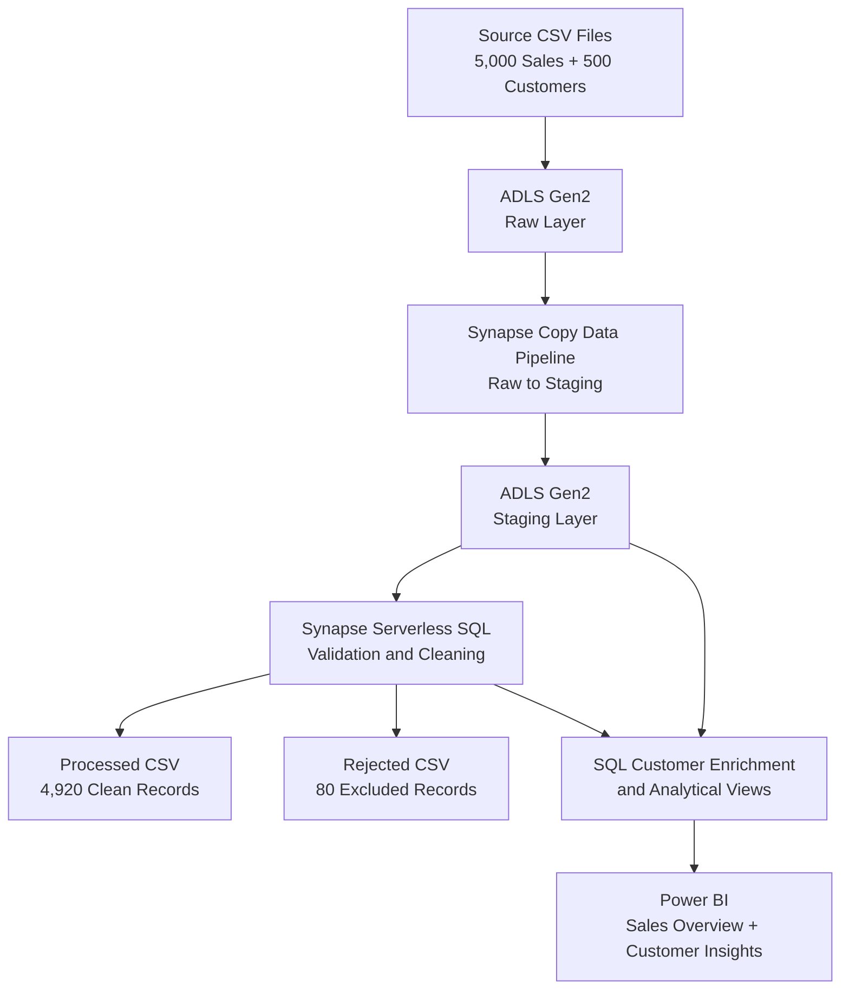

# Azure Retail Sales Data Engineering Architecture

```mermaid
flowchart TD
    A["Source CSV Files<br/>5,000 Sales + 500 Customers"]
    B["ADLS Gen2<br/>Raw Layer"]
    C["Synapse Copy Data Pipeline<br/>Raw to Staging"]
    D["ADLS Gen2<br/>Staging Layer"]
    E["Synapse Serverless SQL<br/>Validation and Cleaning"]
    F["Processed CSV<br/>4,920 Clean Records"]
    G["Rejected CSV<br/>80 Excluded Records"]
    H["SQL Customer Enrichment<br/>and Analytical Views"]
    I["Power BI<br/>Sales Overview + Customer Insights"]

    A --> B
    B --> C
    C --> D
    D --> E
    E --> F
    E --> G
    D --> H
    E --> H
    H --> I
```
